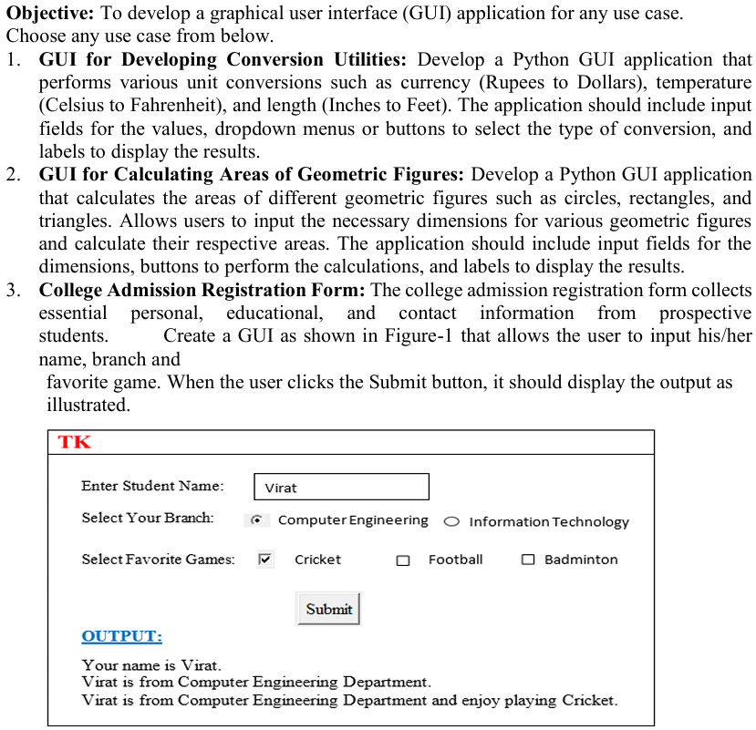

# Practical 7 – GUI Development in Python

## 5.2 GUI Development using Python

### Introduction
Graphical User Interfaces (GUIs) allow users to interact with programs visually, using windows, buttons, text fields, and labels instead of typing commands in the console. Python provides several frameworks for GUI development, with **tkinter** being the most widely used because it is built into Python and easy to learn.

In this practical, you will learn how to:
- Create windows and add widgets (buttons, labels, text boxes).
- Handle user input and events.
- Build simple applications that perform calculations or conversions.
- Apply these concepts to real-world scenarios.

---

### Basics of tkinter
1. **Importing tkinter**
   ```python
   import tkinter as tk
   ```

2. **Creating a window**
   ```python
   root = tk.Tk()
   root.title("My First GUI")
   root.geometry("300x200")
   root.mainloop()
   ```

   - `Tk()` creates the main application window.
   - `title()` sets the window title.
   - `geometry()` sets the size of the window.
   - `mainloop()` keeps the window open until the user closes it.

---

### Adding Widgets
Widgets are the building blocks of GUIs. Common widgets include:
- Label: Displays text.
- Entry: Allows user input.
- Button: Performs an action when clicked.
- Combobox: Dropdown menu for selecting options.

Example:
```python
import tkinter as tk

root = tk.Tk()
root.title("Widgets Example")

label = tk.Label(root, text="Enter your name:")
label.pack()

entry = tk.Entry(root)
entry.pack()

def greet():
    name = entry.get()
    label_result.config(text=f"Hello, {name}!")

button = tk.Button(root, text="Submit", command=greet)
button.pack()

label_result = tk.Label(root, text="")
label_result.pack()

root.mainloop()
```
---

### Event Handling
Events are actions performed by the user (like clicking a button). In tkinter:
- You define a function (callback).
- You attach the function to a widget using command.

Example:
```python
def calculate_square():
    num = int(entry.get())
    result = num * num
    label_result.config(text=f"Square: {result}")
```
---

### Layout Management
tkinter provides three layout managers:
- `pack()`: Places widgets in blocks (top, bottom, left, right).
- `grid()`: Places widgets in a table-like structure.
- `place()`: Places widgets at specific coordinates.

Example using grid:
```python
label1 = tk.Label(root, text="Number:")
label1.grid(row=0, column=0)

entry = tk.Entry(root)
entry.grid(row=0, column=1)

button = tk.Button(root, text="Calculate", command=calculate_square)
button.grid(row=1, column=0, columnspan=2)
```
---

### Summary
In this practical, you will:
- Learn how to create windows and add widgets using tkinter.
- Understand event handling and layout management.
- Build GUI applications for real-world problems.

### Notes for Students
- Follow the instructions carefully.
- Do not copy the examples directly into your task solutions; they are meant to guide you.
- Your tasks will require you to design GUIs for conversion utilities, geometric calculations, and forms.
- Focus on understanding how widgets, events, and layouts work together.

# Tasks
